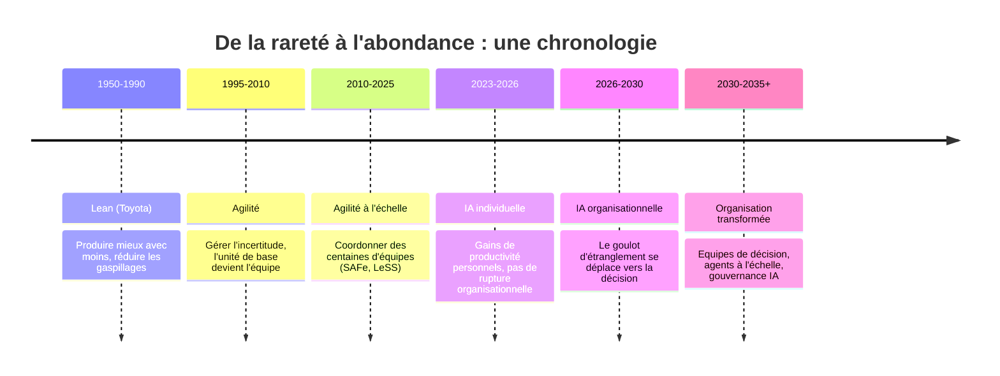
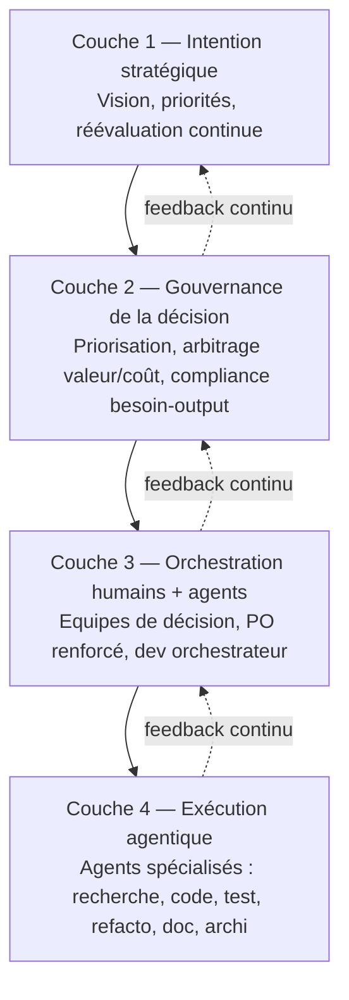

# Livre blanc

# De l'agilité de la production à l'agilité de la décision

## Comment l'IA recompose nos organisations, nos métiers et nos rituels agiles

_Préconisations et framework prospectif_

---

## Sommaire

1. Résumé exécutif
2. Introduction : pourquoi ce livre blanc, et pourquoi maintenant
3. D'où l'on vient : une chronologie pour comprendre ce qui va changer
4. Ce que l'IA change réellement : de la rareté à l'abondance
5. Business to code : le développeur devient orchestrateur d'agents
6. Les rôles se recomposent : PO, développeur, manager, coach
7. Le cas du manager : people care, chapter leader ou les deux ?
8. Ne pas jeter le bébé avec l'eau du bain : la leçon Tesla
9. Le nouveau Delivery Lifecycle
10. Les tokens deviennent un budget : gouverner la ressource IA
11. Rituels agiles : ce qui meurt, ce qui mute, ce qui reste à inventer
12. Framework proposé : gouvernance et méthodologie pour l'ère agentique
13. Trajectoire de mise en œuvre
14. Conclusion
15. Annexes : glossaire et sources

---

## 1. Résumé exécutif

Pendant vingt ans, l'agilité a organisé la rareté : rareté du temps de développement, rareté de l'expertise, rareté de l'attention humaine. Elle a construit des rituels, des rôles et des métriques pour faire circuler l'information et réduire l'incertitude dans un monde où produire coûtait cher.

L'arrivée d'agents IA capables de coder, tester, documenter et refactorer change la donne de manière structurelle : le coût marginal de production de logiciel s'effondre. Ce livre blanc défend une thèse simple : **l'IA ne remet pas en cause les principes de l'agilité — elle en révèle enfin le véritable enjeu**, qui n'a jamais été la vélocité, mais la capacité à choisir, apprendre et s'adapter plus vite que son environnement.

Le goulot d'étranglement se déplace de la **production** vers la **décision** : gouvernance, priorisation, clarté du besoin, vision produit, gestion du changement. Les métiers agiles (PO, Scrum Master, coach, manager) ne disparaissent pas, mais leur centre de gravité change radicalement. Les organisations qui gagneront ne seront pas celles qui produisent le plus vite, mais celles qui :

- clarifient le mieux leurs intentions et leurs besoins,
- gouvernent le mieux leurs agents et leurs décisions,
- apprennent le plus vite de leurs erreurs (rendues moins coûteuses par l'IA),
- maintiennent, malgré la délégation à l'IA, la compétence critique de leurs équipes.

Ce livre blanc propose une chronologie, un état des lieux de la littérature actuelle, une analyse rôle par rôle, une matrice des rituels agiles à conserver, transformer ou inventer, et un **framework de gouvernance en quatre couches** pour accompagner cette transition sur un horizon pluriannuel.

---

## 2. Introduction : pourquoi ce livre blanc, et pourquoi maintenant

Nous accompagnons depuis plusieurs années des transformations agiles : améliorer le delivery, recentrer les équipes sur la valeur, réduire l'effet tunnel, développer l'autonomie et la collaboration. Ce travail reste pertinent. Mais un nouveau paramètre s'est ajouté à l'équation : des agents IA capables de produire du code, des tests, de la documentation et de l'analyse à une vitesse et à une échelle qu'aucune équipe humaine ne peut égaler.

Ce livre blanc ne prétend pas prédire l'avenir avec certitude. Il propose une **trajectoire raisonnée**, construite à partir de ce qui est déjà observable aujourd'hui (gains de productivité individuels via les assistants IA, premiers agents autonomes de développement) et de ce que la littérature de gestion, de FinOps et de conseil en organisation anticipe pour les prochaines années. Il s'adresse aux dirigeants, aux directions produit et delivery, aux coachs agiles et aux managers qui doivent, dès aujourd'hui, commencer à préparer cette bascule — pas dans l'urgence, mais avec méthode.

L'horizon de ce document est celui d'une **grande organisation**, avec ses contraintes de gouvernance, de compliance et d'échelle. Les délais indiqués (2027, 2030, 2035) sont des repères de trajectoire, pas des prévisions précises : chaque organisation avancera à son rythme, selon sa taille, son secteur et sa maturité technologique.

---

## 3. D'où l'on vient : une chronologie pour comprendre ce qui va changer

Comprendre ce qui va changer suppose de comprendre pourquoi les pratiques actuelles existent. Chaque grande évolution du management de la production a répondu à une contrainte dominante de son époque.

|Période|Problème dominant|Réponse apportée|Unité de base|
|---|---|---|---|
|Lean (1950-1990)|Produire mieux avec moins|Flux tiré, réduction des gaspillages, amélioration continue|Le flux|
|Agilité (1995-2010)|Gérer l'incertitude du logiciel complexe|Sprints, user stories, feedback rapide, équipes autonomes|L'équipe|
|Agilité à l'échelle (2010-2025)|Coordonner des dizaines d'équipes|SAFe, LeSS, PI Planning, OKR|Le train agile|
|IA individuelle (2023-2026)|Productivité personnelle|Copilotes de code, assistants génératifs|L'individu augmenté|
|IA organisationnelle (2026-2030)|Absorber une production x5 à x10|Recomposition des rôles, PO renforcé, moins de développeurs par équipe|L'équipe augmentée|
|Organisation transformée (2030-2035)|Gouverner des écosystèmes d'agents|Équipes de décision, orchestration d'agents, FinOps de l'IA|La capacité / le système de décision|

Ce que montre cette chronologie : **chaque étape n'a pas supprimé la précédente, elle en a déplacé le centre de gravité**. Le Lean n'a pas disparu avec l'agilité — il en irrigue toujours les principes (flux, amélioration continue). De la même manière, l'IA ne supprimera pas l'agilité : elle va en radicaliser l'intention initiale, celle de répondre au changement plutôt que de suivre un plan.

---

## 4. Ce que l'IA change réellement : de la rareté à l'abondance

Le contexte historique qui a fait naître l'agilité reposait sur cinq contraintes : développement coûteux, délais de réalisation longs, expertise rare, communication imparfaite, difficulté à anticiper les besoins. L'agilité a construit des mécanismes pour **réduire l'incertitude dans un monde de rareté**.

L'IA ne supprime pas l'incertitude — mais elle fait disparaître une partie du coût de production de la connaissance et du code. Le goulot d'étranglement se déplace :

**Avant** : le goulot d'étranglement, c'était la production (écrire le code, le tester, le documenter). **Après** : le goulot d'étranglement devient la prise de décision, la gouvernance, la stratégie, la priorisation et l'alignement humain.

C'est une bascule que documente également McKinsey dans son étude _The State of Organizations 2026_ : les entreprises interrogées décrivent une transformation à double niveau, technologique et organisationnel, où la difficulté n'est plus de déployer l'IA elle-même mais de reconcevoir les workflows et la gouvernance autour d'elle — seuls 14 % des organisations disposent aujourd'hui d'une direction qui porte une stratégie IA claire et constante. Le même rapport souligne qu'environ 75 % des rôles actuels devront être remaniés à mesure que l'IA s'intègre aux processus, non pas supprimés en bloc, mais redessinés dans leur contenu.

Ce déplacement se lit également dans la conclusion la plus structurante de ce livre blanc :

> L'agilité est née pour gérer la **rareté** des capacités de production. L'IA crée une **abondance** de capacités de production. Dans ce nouveau contexte, l'avantage compétitif ne vient plus de la capacité à construire vite, mais de la capacité à choisir les bonnes choses à construire, à les gouverner efficacement et à apprendre plus vite que les autres.

---

## 5. Business to code : le développeur devient orchestrateur d'agents

Le schéma classique de la delivery logicielle suit une chaîne : **besoin métier → spécification → code → test → mise en production**, avec à chaque étape des acteurs humains spécialisés. Cette chaîne existait parce que chaque transformation (du besoin en spec, de la spec en code) coûtait du temps et de l'expertise humaine rare.

Avec des agents IA spécialisés (recherche, codage, tests, refactoring, valorisation de la donnée, architecture), cette chaîne se contracte. On passe progressivement d'un modèle **Business needs → Spec → Code** à un modèle que l'on peut résumer par **Business to code** : l'intention métier, correctement clarifiée et cadrée, peut être transformée directement en artefact logiciel exécutable, sous supervision humaine.

Dans ce modèle, le développeur ne disparaît pas — il change de fonction. Il devient **orchestrateur d'une équipe d'agents** :

- un agent recherche/discovery (analyse de besoin, benchmark technique),
- un agent codeur,
- un agent testeur,
- un agent refactoring,
- un agent architecte,
- un agent documentation,
- un agent qualité/sécurité.

Le développeur définit l'intention, arbitre entre les propositions, valide, corrige la trajectoire. Il devient, selon les organisations, un _AI Software Engineer_ ou un _superviseur de production logicielle_. Ce n'est pas une nuance sémantique : cela change le ratio d'effectifs (moins de développeurs par équipe), le profil recherché (jugement, architecture, sens du risque plutôt que seule vitesse de frappe du code) et la nature du management de cette fonction.

**Ce que cela déplace en cascade** :

1. Le goulot d'étranglement n'est plus le codage, mais l'expression claire du besoin — d'où le rôle accru du PO (voir section 6).
2. De nouveaux goulots apparaissent en aval : comment vérifier que ce qui est produit très vite correspond réellement au besoin (compliance besoin/output) ? Comment s'assurer qu'on reste au bon endroit de la création de valeur, et non dans une fuite en avant de production ?
3. Le test et la revue de qualité deviennent critiques, au moins tant que la confiance dans le code généré par IA n'est pas totale — d'où un besoin accru, et non diminué, de vigilance sur la qualité, au moins dans la phase de transition.

---

## 6. Les rôles se recomposent

### 6.1 Le Product Owner : de la rédaction de user stories à l'arbitrage de valeur

Le PO d'aujourd'hui arbitre le budget, la capacité de l'équipe et le délai, et rédige des user stories pour que les développeurs comprennent le besoin. Demain, la rédaction fine du besoin sous forme de story découpée perd une partie de son utilité : on ne s'adresse plus seulement à des humains qui ont besoin d'un langage commun standardisé, mais aussi à des IA capables de travailler sur des périmètres plus larges et plus ambigus.

Le rôle du PO se déplace donc vers :

- **la clarification du besoin** — condition sine qua non pour qu'il soit correctement implémentable par des agents. Un besoin mal cadré, donné à une IA qui produit vite et à l'échelle, se traduit par une dette fonctionnelle générée à grande vitesse ;
- **l'arbitrage valeur / coût / rentabilité** — car produire plus vite consomme des ressources (tokens, énergie, plateformes) qui ont un coût réel et doivent être mises en regard de la valeur produite ;
- **le pilotage du feedback utilisateur en continu**, avec des cycles de feature flipping (déploiement progressif à des groupes d'utilisateurs) beaucoup plus fréquents que le rythme des sprints classiques ;
- **la capacité à changer de cap rapidement** selon les retours réels, dans un monde où le refacto est rapide et peu coûteux, et où le droit à l'erreur redevient un atout plutôt qu'un risque.

Le PO devient ainsi un véritable **Product Strategist**, moins occupé par la forme (écrire des tickets) et davantage par le fond (la vision, la priorité, le sens économique).

### 6.2 Le développeur : de la production au jugement

Comme détaillé en section 5, le développeur devient superviseur et orchestrateur. Sa valeur se déplace de « écrire du code correct » vers « définir la bonne intention, détecter les mauvaises propositions, arbitrer les compromis techniques et garantir la cohérence architecturale ».

### 6.3 Le testeur : un rôle qui se renforce, au moins temporairement

Contrairement à une lecture trop rapide (« l'IA teste, donc plus besoin de testeurs »), la phase de transition demande probablement **davantage** d'attention portée aux tests et à la validation, car le volume de code produit augmente plus vite que la confiance qu'on peut accorder à ce code. Le rôle du testeur évolue vers la supervision des agents de test, la définition des zones de risque à couvrir en priorité, et le contrôle qualité de bout en bout plutôt que l'écriture manuelle de cas de test.

### 6.4 Le Coach Agile et le Scrum Master : la partie "framework" devient une commodité

Une partie historique du métier de coach agile — l'animation de cérémonies standard, la formation aux bases de Scrum, l'accompagnement au découpage de user stories — est largement automatisable : l'IA connaît déjà Scrum, Kanban, SAFe, l'estimation, et peut produire seule des supports de formation ou des diagnostics agiles standards.

En revanche, **ce qui reste durablement humain** : les vrais problèmes d'une équipe ne sont presque jamais un daily trop long ou une user story mal écrite — ce sont des conflits politiques, un manque de confiance, des tensions entre managers, des enjeux de pouvoir, une peur du changement, une culture organisationnelle bloquante. Sur ces sujets, l'IA reste très limitée, car ce sont des systèmes humains complexes, pas des systèmes d'information.

Le coach de demain ressemble donc moins à un expert de framework qu'à un **designer d'organisations hybrides humains + IA**, capable de coacher des dirigeants sur la gouvernance, la transformation culturelle et les modes de décision — un rôle proche de celui d'un consultant en transformation organisationnelle plus que d'un facilitateur d'atelier Scrum.

---

## 7. Le cas du manager : people care, chapter leader, ou les deux ?

C'est probablement la question la plus structurante pour les grandes organisations : que devient le management hiérarchique pyramidal, construit historiquement pour gérer de grandes quantités de personnes et de longues chaînes de décision, quand les équipes de production rétrécissent fortement ?

### 7.1 Deux hypothèses en tension

**Hypothèse A — le manager devient "people care" / accompagnement humain.** Avec des équipes plus petites et plus autonomes vis-à-vis des IA, le rôle managérial se recentre sur le développement des personnes, la gestion du changement individuel, la santé psychologique face à la vitesse et à l'incertitude accrues.

**Hypothèse B — le manager devient visionnaire / arbitre stratégique.** L'IA ne sait pas choisir une direction stratégique. Dans un monde où l'exécution est largement automatisée, la vision devient le facteur différenciant. Le manager se rapproche alors d'un rôle de product strategist ou de décideur de haut niveau.

En réalité, ces deux hypothèses ne s'excluent pas : elles correspondent à deux fonctions historiquement confondues dans le rôle de manager (le management "hiérarchique", responsable RH et carrière, et le management "de délivery", responsable de la coordination du travail). L'IA, en absorbant une bonne partie de la coordination de délivery, **sépare mécaniquement ces deux fonctions** — ce qui pousse vers un modèle organisationnel où elles sont explicitement distinguées plutôt que portées par la même personne.

### 7.2 Le modèle Spotify (chapter lead) : ce qu'il faut en retenir, et ce qu'il faut éviter

Le rôle de "chapter lead" évoque une piste intéressante : dans le modèle publié par Spotify en 2012 (tribes, squads, chapters, guilds), le **Chapter Lead** est le manager hiérarchique des personnes d'une même discipline (par exemple, tous les développeurs backend d'une tribu), séparé du "squad" dans lequel elles travaillent au quotidien. L'intérêt de ce modèle est justement de permettre aux personnes de changer d'équipe (squad) sans changer de manager (chapter), et de séparer la gestion de carrière/compétence de la gestion du delivery au jour le jour.

Il faut toutefois nuancer cette référence, pour deux raisons documentées dans la littérature récente :

1. **Spotify elle-même a fait évoluer ce modèle.** Le document de 2012 n'était qu'une photographie d'un instant T, pour une organisation d'environ 250 ingénieurs, et n'a jamais été un blueprint figé. Les praticiens qui ont suivi l'évolution de Spotify rapportent que le rôle de Chapter Lead a été remplacé par celui d'"Engineering Manager", rattaché la plupart du temps à un seul squad — la tension structurelle entre delivery et développement de la discipline n'a pas disparu, elle a simplement changé de nom.
2. **La reprise du modèle Spotify par de nombreuses entreprises a souvent échoué**, précisément parce qu'elles ont copié la structure (squads, tribus, chapitres, guildes) sans adopter la culture sous-jacente (autonomie réelle, confiance, tolérance à l'inconsistance que produit l'autonomie). Le principal enseignement à retenir n'est donc pas "copier les chapitres", mais le **principe** qu'ils portaient : organiser les équipes par contribution de valeur (le squad) tout en maintenant, séparément, un lieu de développement des compétences et de gestion de carrière (le chapitre ou une structure équivalente).

Pour notre framework, la piste du "chapter leader" (ou d'un équivalent) est donc pertinente à condition de la traiter comme **un principe organisationnel** ("séparer la responsabilité delivery de la responsabilité compétence/carrière") plutôt que comme une structure à recopier telle quelle.

### 7.3 La fin des départements de 200 personnes ?

Une organisation où un développeur supervise une équipe d'agents, où les équipes rétrécissent (1 dev senior + quelques experts métier + des agents spécialisés plutôt que 6 développeurs, 2 testeurs, 1 UX), rend effectivement moins pertinents les grands départements pyramidaux construits pour gérer de la masse humaine. Le besoin de chaînes de décision longues diminue mécaniquement quand le nombre de personnes à coordonner diminue. Cela ne signifie pas la fin du management, mais un **basculement d'un management de coordination de masse vers un management de gouvernance de capacités** — plus petit en nombre de subordonnés directs, mais plus stratégique dans son périmètre de décision.

---

## 8. Ne pas jeter le bébé avec l'eau du bain : la leçon Tesla

Un des risques majeurs des transformations pilotées par l'IA est la tentation de réduire trop vite les effectifs, en pariant que l'IA peut immédiatement compenser la perte de compétence humaine. Les faits récents invitent à la prudence.

Tesla a procédé en 2024 à des vagues de licenciements massives — près de 20 000 postes supprimés en quelques mois, touchant des équipes entières y compris certaines très performantes (par exemple l'équipe Supercharger). Plusieurs de ces suppressions se sont révélées trop rapides : des cadres et experts seniors ont dû être **réembauchés en quelques semaines** lorsque l'impact opérationnel de leur départ est devenu impossible à ignorer, notamment sur les compétences critiques d'infrastructure et de déploiement.

Ce cas Tesla n'est pas isolé. Une enquête menée en 2026 auprès de 600 responsables RH ayant piloté des restructurations liées à l'IA montre que :

- près d'un tiers des organisations (32,9 %) déclarent avoir perdu des compétences ou une expertise critique après avoir licencié dans le cadre d'une restructuration pilotée par l'IA ;
- deux tiers des employeurs ayant supprimé des postes liés à l'IA sont déjà en train de réembaucher, souvent en quelques mois ;
- plus de la moitié des responsables RH interrogés indiquent que les systèmes d'IA ont nécessité davantage de supervision et de jugement humain qu'anticipé ;
- sur le plan financier, les économies espérées se sont souvent révélées inférieures aux attentes : dans près d'un tiers des cas, le coût de réembauche a dépassé les économies initialement réalisées.

**Ce que cela implique pour le framework de gouvernance** : la gestion du risque de compétence doit devenir une responsabilité explicite, portée par le management (voir section 7), au même titre que la gestion budgétaire ou la gestion de la qualité. Trois principes en découlent :

1. **Ne jamais déléguer à l'IA une compétence sans maintenir un socle humain capable de la superviser, de la challenger et, en cas de défaillance de l'IA, de reprendre la main.** Cela vaut particulièrement pour les compétences dites "critiques" : architecture, sécurité, connaissance métier profonde, relation client sensible.
2. **Prévoir des mécanismes actifs de maintien de compétence** (rotation, formation continue, exercices de "reprise en main manuelle" périodiques), plutôt que de laisser la compétence s'éroder silencieusement au fil de la délégation croissante à l'IA.
3. **Traiter la réduction d'effectifs comme une décision de gestion du risque, pas seulement de gestion du coût** — avec un scénario de réversibilité explicite avant toute suppression de poste jugée "non essentielle grâce à l'IA".

---

## 9. Le nouveau Delivery Lifecycle

Le cycle de vie de la delivery logicielle change à chaque étape, et pas seulement au niveau du développement.

|Étape|Avant|Après (IA)|
|---|---|---|
|**Discovery**|Le PM mène des interviews, analyse des données, rédige des personae — plusieurs semaines|Des agents analysent des milliers de verbatims, synthétisent les tickets support, détectent les irritants ; le PM passe plus de temps à arbitrer qu'à collecter|
|**Backlog**|Construction manuelle d'epics, features, user stories, dépendances|L'IA génère le backlog, identifie les dépendances, détecte les incohérences, propose plusieurs scénarios de découpage|
|**Priorisation**|WSJF, Value vs Effort, RICE, basés sur des estimations humaines|L'IA intègre historique, complexité réelle, dépendances, usage client, impact financier ; priorisation davantage pilotée par la donnée|
|**Développement**|Le développeur écrit le code, cherche la documentation, corrige les bugs|Le développeur définit l'intention, valide, supervise ; l'IA produit, refactore, documente, détecte les vulnérabilités|
|**Tests & qualité**|Tests manuels ou semi-automatisés, couverture partielle|Les agents qualité génèrent les tests, identifient les zones à risque, créent les jeux de données, analysent les régressions — la qualité se vérifie plus tôt|
|**DevOps / Production**|Les équipes surveillent logs, alertes, incidents|Les agents corrèlent les incidents, identifient les causes probables, proposent voire déclenchent certaines remédiations|
|**Mesure de la valeur**|Vélocité, lead time, cycle time, débit|L'IA relie feature / usage / adoption / impact métier / ROI|

### 9.1 La boucle de feedback devient l'organe central

En agilité classique, la boucle de feedback utilisateur se faisait principalement lors des reviews d'incrément, au rythme du sprint. Demain, un sprint peut produire un produit quasiment complet : la boucle de feedback ne peut donc plus être un rituel ponctuel, elle doit devenir un **flux continu**, structuré autour de deux niveaux distincts :

- **la boucle de vérification technique** : des agents IA vérifient que ce que produisent d'autres agents IA correspond bien à la demande initiale — ce qui suppose des instructions claires à la fois pour produire _et_ pour vérifier, et une définition explicite des critères d'acceptation ;
- **la boucle de feedback utilisateur** : est-ce que ce qui est produit crée réellement la valeur attendue ? Cette boucle s'appuie sur du feature flipping généralisé (déploiement progressif à des cohortes d'utilisateurs), avec une capacité à changer de cap rapidement selon les résultats observés — un changement de paradigme réel par rapport à des roadmaps figées sur plusieurs mois.

### 9.2 Le droit à l'erreur redevient un atout

Le refactoring rapide et peu coûteux change la nature du risque : une mauvaise décision peut être corrigée bien plus vite. Cela ne dispense pas de gouvernance (voir section 10) — une mauvaise décision est aussi _diffusée_ plus vite — mais cela permet de restaurer une véritable culture de l'expérimentation, plus proche de l'esprit originel de l'agilité que ne l'étaient des roadmaps figées sur plusieurs mois.

---

## 10. Les tokens deviennent un budget : gouverner la ressource IA

À mesure que les organisations déploient des modèles plus puissants, des contextes plus longs et davantage d'agents, la consommation de tokens devient un poste de coût opérationnel récurrent, comparable au cloud ou aux licences SaaS. Cette évolution est déjà largement documentée par la littérature FinOps 2026 : la discipline émergente s'appelle le **TokenOps** (ou AI FinOps), définie comme l'application des principes du FinOps — visibilité, allocation, optimisation, gouvernance — à la consommation de tokens des LLM.

Quelques repères tirés de cette littérature récente :

- près de 98 % des organisations pilotent désormais activement leurs dépenses IA, contre environ 31 % deux ans plus tôt ;
- environ 85 % des budgets IA d'entreprise vont désormais à l'inférence (contre environ un tiers en 2023) ;
- le FinOps Foundation constate un écart de prix pouvant atteindre plusieurs centaines de fois entre les tokens de sortie des modèles les moins chers et les plus chers, ce qui rend le choix du "bon modèle pour le bon usage" hautement stratégique ;
- des cas documentés de dérive de coûts liés à des agents bloqués dans des boucles de raisonnement ("infinite loops") montrent que la gouvernance de la consommation n'est pas un sujet théorique.

### 10.1 Ce que le PO devra désormais arbitrer

Aujourd'hui, un PO arbitre le budget, la capacité de l'équipe et le délai. Demain, il devra probablement arbitrer également :

- le coût de l'usage des modèles,
- le choix entre plusieurs modèles (léger ou très performant) selon la criticité de la tâche,
- le niveau d'autonomie accordé aux agents.

Cela ressemble à la gestion du cloud : on ne cherche pas seulement à consommer moins, on cherche à **consommer au bon endroit, pour le bon usage**.

### 10.2 De nouvelles métriques

Les métriques historiques (story points, vélocité, nombre de user stories, nombre de tickets traités) perdent de la pertinence à mesure que l'effort de production diminue. Elles doivent être complétées, voire remplacées, par :

|Nouvelle métrique|Ce qu'elle mesure|
|---|---|
|**Value Time**|Temps entre l'identification d'une opportunité et la valeur constatée|
|**Decision Latency**|Temps nécessaire pour prendre une décision|
|**Learning Velocity**|Vitesse à laquelle l'organisation apprend de ses expérimentations|
|**AI Leverage**|Part du travail accéléré par l'IA|
|**Value Realization**|Valeur effectivement créée, rapportée au coût engagé|
|**Coût IA par fonctionnalité / par équipe**|Coût direct de la consommation de modèles, tagué par usage|
|**ROI des agents IA**|Retour sur investissement d'un agent ou d'une capacité IA donnée|

### 10.3 Sobriété : le Lean appliqué à l'IA

Comme pour le Lean, l'objectif n'est pas de minimiser une ressource pour elle-même, mais d'**éliminer le gaspillage**. Concrètement : réutiliser des résultats plutôt que relancer systématiquement un modèle, réserver les modèles puissants aux tâches complexes, limiter les contextes transmis lorsque ce n'est pas nécessaire, mutualiser certains agents entre équipes. Les tokens ne doivent pas devenir une nouvelle métrique agile isolée à optimiser pour elle-même : ils doivent devenir une composante du coût du flux de valeur, mise en regard des résultats obtenus.

---

## 11. Rituels agiles : ce qui meurt, ce qui mute, ce qui reste à inventer

C'est le cœur opérationnel de ce livre blanc. La question n'est pas "l'agilité est-elle morte", mais **quels rituels ont été inventés pour pallier une contrainte qui disparaît, et lesquels répondent à un besoin humain intemporel**.

### 11.1 Ce qui perd fortement de sa raison d'être

|Pratique|Pourquoi elle s'efface|
|---|---|
|Estimation détaillée (planning poker, story points fins)|Pourquoi estimer précisément une charge qui peut être produite en quelques heures ?|
|Découpage excessif en user stories|L'IA travaille efficacement sur des périmètres plus larges et plus ambigus|
|Coordination manuelle de tâches / dépendances|Les outils IA synchronisent automatiquement une grande partie des dépendances|
|Reporting manuel|Une large part du reporting devient automatique, généré en continu par les agents|
|Daily meeting "de statut" classique|Un dashboard IA en temps réel peut remplacer le tour de table de statut|
|PI Planning "grand messe" de 2 jours pour estimer la charge de toutes les équipes|Les scénarios, dépendances, capacités peuvent être préparés en amont par l'IA|

### 11.2 Ce qui devient beaucoup plus important

|Enjeu|Pourquoi il monte en importance|
|---|---|
|Gouvernance|L'IA accélère tout — une mauvaise décision est prise plus vite et diffusée plus largement|
|Priorisation réelle|Le coût de réalisation baisse, le coût de la mauvaise priorité augmente relativement|
|Vision produit|L'IA ne sait pas choisir une direction stratégique — la vision devient un facteur différenciant majeur|
|Gestion du changement|Le défi principal devient humain plus que technique : que déléguer, à quel niveau de confiance, qui décide, qui porte la responsabilité|
|Clarté d'intention / du besoin|Un besoin mal cadré transmis à une IA produit de la dette à grande échelle|
|Vérification / compliance besoin-output|Il faut s'assurer que ce qui est produit très vite correspond bien à ce qui a été demandé et reste au bon endroit de valeur|

### 11.3 Ce qui mute plutôt que de disparaître

Il serait trompeur de dire simplement "on n'a plus besoin de X" sans proposer d'alternative — c'est une limite du premier jet de ce document, corrigée ici. Le tableau ci-dessous propose, pour chaque rituel agile classique, sa **mutation probable** plutôt que sa simple disparition.

|Rituel classique|Fonction réelle qu'il remplissait|Ce qu'il devient|
|---|---|---|
|**Daily Scrum**|Synchronisation, détection rapide des blocages|Un dashboard IA temps réel remplace le statut ; le temps humain libéré sert à discuter des blocages réels de décision, pas de statut de tâches|
|**Sprint Review**|Montrer l'incrément, recueillir le feedback|Devient une **instance de feedback utilisateur continu** : revue de cohortes en feature flipping, analyse d'usage réel plutôt que démonstration ponctuelle|
|**Rétrospective**|Amélioration continue de l'équipe|Mute en **introspection agentique** : surveillance continue du processus humains + agents, avec recommandations d'amélioration générées et challengées, complétée par un temps humain dédié aux tensions non détectables par l'IA (confiance, conflits, culture)|
|**Sprint Planning**|Découper et engager la charge du sprint|Devient un temps d'**arbitrage de priorité et de valeur**, préparé par des scénarios générés par l'IA ; l'engagement porte sur des résultats, pas sur une charge|
|**PI Planning**|Construire un plan, aligner les équipes, créer de l'engagement, gérer les dépendances|Deux trajectoires possibles (voir 11.4) : soit un PI Planning "nouvelle formule" raccourci et préparé par l'IA, soit sa disparition au profit d'une planification continue|
|**Backlog Refinement**|Clarifier et affiner les besoins avant réalisation|Devient un dialogue permanent entre le PO/Product Strategist et les agents, avec un backlog dynamique généré et mis à jour en continu|
|**Story Mapping / Estimation**|Anticiper la charge et le périmètre|Diminue fortement en fréquence et en granularité ; conservé ponctuellement pour les décisions stratégiques à fort enjeu|

### 11.4 Le cas du PI Planning : stop ou encore ?

Le PI Planning cristallise bien la tension entre ce qui disparaît et ce qui reste. Il servait à construire un plan, identifier les dépendances, aligner tout le monde, créer de l'engagement. L'IA rend obsolète la préparation manuelle du plan, les ROAM manuels, les program boards manuels. Mais elle ne rend pas obsolète le besoin de construire une **compréhension commune**, d'arbitrer les conflits de priorité, de négocier entre plusieurs scénarios.

Deux trajectoires sont envisageables, et elles ne sont pas mutuellement exclusives dans le temps — la première est probablement une étape transitoire vers la seconde :

**Option 1 — PI Planning nouvelle formule (probable à moyen terme).** Avant l'événement, l'IA prépare plusieurs scénarios, les dépendances, les capacités, les risques et les impacts business. Pendant l'événement — vraisemblablement raccourci — les humains se concentrent sur les arbitrages, les décisions et les compromis. Après l'événement, l'IA met à jour le plan en continu : le plan devient un objet vivant plutôt qu'un artefact figé pour trois mois.

**Option 2 — disparition de l'événement "grande messe" (probable à plus long terme).** Dès lors que les dépendances sont gérées automatiquement, que les capacités sont calculées en temps réel et que les plans sont recalculés en continu, le besoin d'un grand événement trimestriel diminue fortement au profit d'une **planification continue, d'un alignement continu, et d'une prise de décision continue** — une évolution également documentée dans la littérature 2026 sur la planification financière et stratégique continue (continuous planning), qui constate que les cycles de planification annuels ou trimestriels classiques ne suivent plus le rythme de la volatilité et de l'incertitude actuelles, quel que soit le secteur.

Cette évolution rejoint directement l'intuition initiale de ce livre blanc : la notion même de "plan" figé sur plusieurs mois, contraire à l'intention originelle de l'agilité, tend à s'effacer au profit d'une intention stratégique réévaluée en continu.

### 11.5 Les nouvelles instances à inventer

Certains besoins n'existaient pas — ou existaient peu — dans le playbook agile classique, et méritent d'être explicitement instanciés :

- **Une instance de gouvernance des agents IA** : quels agents sont autorisés, sur quel périmètre, avec quel niveau d'autonomie, avec quel droit de véto humain ;
- **Une instance de revue de compliance besoin/output** : vérifier régulièrement que ce qui est produit à grande vitesse correspond réellement à l'intention métier, et non à une dérive silencieuse ;
- **Une instance d'alignement stratégique en continu** : remplacer la vision figée à 3 ans par une réévaluation régulière et rythmée de la stratégie, à la fréquence dictée par la vitesse réelle du marché et non par un calendrier budgétaire arbitraire ;
- **Une instance de supervision du parcours client / de la cohérence produit** : à mesure que des "galaxies" de produits sont gérées par des équipes ou agents relativement autonomes, il faut un lieu où l'on garantit que le parcours utilisateur global reste cohérent, faute de quoi l'autonomie des équipes se traduit par une expérience fragmentée pour l'utilisateur final ;
- **Une instance de FinOps IA / revue de consommation** : arbitrer régulièrement le rapport coût de consommation IA / valeur produite, au niveau équipe et au niveau portefeuille.

---

## 12. Framework proposé : gouvernance et méthodologie pour l'ère agentique

Sur la base des sections précédentes, nous proposons un framework organisé en quatre couches, pensé pour être introduit progressivement plutôt que déployé d'un bloc.

### Couche 1 — Intention stratégique

Remplace la planification figée par une **réévaluation continue de la stratégie**, portée par une instance légère mais régulière (plutôt qu'un exercice annuel). Le rôle du manager "visionnaire" (section 7) s'exerce ici. Cette couche définit ce qui ne doit jamais être délégué à l'IA : le choix de direction.

### Couche 2 — Gouvernance de la décision

C'est le nouveau centre de gravité de l'organisation (section 4). Cette couche porte : la priorisation, l'arbitrage valeur/coût/rentabilité (y compris le FinOps IA, section 10), la vérification de compliance besoin/output, et la gestion du risque de compétence (section 8). C'est ici que se loge le rôle renforcé du PO / Product Strategist, et une instance de gouvernance des agents.

### Couche 3 — Orchestration humains + agents

C'est le niveau de l'équipe augmentée : un ou quelques humains (Product Leader, développeur-orchestrateur, experts métier) supervisant plusieurs agents spécialisés. C'est aussi le niveau où se joue la séparation entre gestion du delivery (au jour le jour) et gestion de la compétence/carrière (principe du "chapter", section 7.2), et où le coach agile de demain intervient comme designer d'organisation hybride.

### Couche 4 — Exécution agentique

Le niveau des agents eux-mêmes : recherche, code, test, refactoring, valorisation, architecture, documentation. C'est la couche la plus automatisée, mais elle reste sous supervision humaine constante des couches 2 et 3, avec des boucles de feedback (technique et utilisateur) qui remontent en continu vers les couches supérieures.

### Principes transverses du framework

1. **Décision plutôt que planification.** Chaque instance conservée doit être requalifiée en fonction qu'elle sert réellement : préparer une décision plutôt que construire un plan.
2. **Réversibilité par défaut.** Toute délégation à l'IA (production, décision, réduction d'effectif) doit prévoir explicitement un scénario de reprise en main humaine.
3. **Coût et valeur dans le même geste de décision.** Aucun arbitrage de priorité ne doit être fait sans intégrer le coût de consommation IA associé.
4. **Cohérence globale malgré l'autonomie locale.** L'autonomie donnée aux équipes/agents ne doit jamais se faire au détriment de la cohérence du parcours client — d'où la nécessité d'une instance de supervision transverse (section 11.5).
5. **La compétence humaine critique se maintient activement, elle ne se préserve pas passivement.** Ce principe découle directement du retour d'expérience documenté en section 8.

---

## 13. Trajectoire de mise en œuvre

Ce framework ne se déploie pas d'un coup. Nous proposons une trajectoire en trois grandes étapes, cohérente avec la chronologie de la section 3, à adapter au rythme réel d'adoption technologique de chaque organisation.

**Étape 1 — Équiper et observer (horizon court terme).** Doter les équipes d'assistants IA individuels, mesurer les gains réels de productivité, cartographier les tâches déléguées et celles qui restent humaines. Ne pas encore transformer l'organisation, mais commencer à instrumenter : combien de temps gagné, sur quelles tâches, avec quel niveau de confiance dans le résultat produit.

**Étape 2 — Recomposer les équipes et les rôles (horizon moyen terme).** Réduire progressivement la taille des équipes de réalisation à mesure que la confiance dans les agents augmente, renforcer les effectifs et les compétences côté clarification du besoin (PO/Product Strategist), introduire les premières instances de gouvernance IA (compliance besoin/output, FinOps IA), faire évoluer le rôle du coach agile vers l'accompagnement des PO et de l'organisation plutôt que des développeurs.

**Étape 3 — Transformer la gouvernance et la structure (horizon long terme).** Passer d'une organisation en équipes produit à une organisation davantage orientée résultats/outcomes, introduire les rôles d'orchestration à l'échelle (gouvernance des agents, supervision de cohérence produit), remplacer les grands événements de planification périodiques par une planification et un alignement continus, et acter la séparation entre management de delivery et management de compétence/carrière.

À chaque étape, la question du maintien de compétence (section 8) et celle de la gouvernance des tokens (section 10) doivent être traitées comme des sujets de premier plan, et non comme des annexes techniques.

---

## 14. Conclusion

L'agilité n'a jamais été une fin en soi : c'était une réponse pragmatique à un monde où produire du logiciel coûtait cher, prenait du temps, et mobilisait une expertise rare. L'IA ne rend pas ces principes obsolètes — adaptation, feedback, orientation valeur, collaboration — elle en révèle enfin la véritable portée, en supprimant une grande partie des contraintes qui avaient poussé l'agilité à se scléroser en un ensemble de rituels standardisés.

Ce que l'IA impose, ce n'est pas moins d'agilité, mais une **agilité plus radicale** : décomplexifier le complexe, embrasser réellement l'incertitude, restaurer un vrai droit à l'erreur, construire des boucles de feedback réelles avec les utilisateurs, et faire de l'amélioration continue une pratique vécue plutôt qu'un rituel de calendrier.

Le rôle des organisations — et des accompagnateurs de transformation — n'est donc pas de défendre un ancien playbook, ni de le jeter intégralement, mais de distinguer avec méthode ce qui répondait à une contrainte aujourd'hui levée, et ce qui répond à un besoin humain permanent : donner du sens, arbitrer entre des choix, apprendre ensemble, et se faire confiance dans l'incertitude.

---

## 15. Annexes

### 15.1 Glossaire

- **Business to code** : modèle dans lequel l'intention métier, correctement clarifiée, est transformée directement en artefact logiciel exécutable par des agents IA, sous supervision humaine, sans passage obligé par une spécification technique détaillée intermédiaire.
- **TokenOps / AI FinOps** : discipline appliquant les principes du FinOps (visibilité, allocation, optimisation, gouvernance) à la consommation de tokens et de ressources de calcul liées à l'IA.
- **Feature flipping** : déploiement progressif d'une fonctionnalité à des cohortes ciblées d'utilisateurs, permettant de tester et d'ajuster rapidement selon les retours réels.
- **Compliance besoin/output** : vérification que ce qui est produit par les agents IA correspond effectivement à l'intention métier exprimée.
- **Continuous planning** : modèle de planification stratégique et budgétaire fondé sur des prévisions glissantes et une réévaluation régulière, en remplacement d'un cycle de planification annuel figé.
- **Agentic organization** : modèle organisationnel dans lequel humains et agents IA collaborent structurellement à la création de valeur, avec une gouvernance, des workflows et des pratiques RH repensés autour de cette collaboration.

### 15.2 Principales sources et littérature mobilisées

- McKinsey & Company, _The State of Organizations 2026 : Three tectonic forces that are reshaping organizations_, 2026.
- McKinsey & Company / QuantumBlack, _The agentic organization: Contours of the next paradigm for the AI era_, 2025-2026.
- BCG, _AI at Work: Why Strategy Matters More Than Tools_, enquête annuelle 2026 (~12 000 répondants).
- Careerminds, enquête auprès de 600 responsables RH sur les restructurations pilotées par l'IA, février 2026 (relayée par People Matters).
- HR Grapevine, _Tesla is hiring staff just months after laying off nearly 20,000: This is why reskilling matters_, retour d'expérience Tesla 2024.
- Henrik Kniberg & Anders Ivarsson, _Scaling Agile @ Spotify with Tribes, Squads, Chapters and Guilds_, 2012, et analyses critiques ultérieures du modèle (Jason Yip ; SI Labs ; Peerdom ; Echometer, 2023-2026).
- FinOps Foundation, _FinOps for AI Overview_ et _State of FinOps 2026 Report_ ; Finout, _Token Economics and TokenOps: The Definitive Guide to FinOps for Tokens_, 2026.
- IBM, _What is Continuous Planning?_, 2026 ; Stratrix, _The Continuous Planning Transformation_, 2026.
- Matthew Skelton & Manuel Pais, _Team Topologies_, 2019 (référence structurante sur les équipes orientées flux de valeur).

_Ce livre blanc constitue un document de travail prospectif, destiné à nourrir la réflexion et à être enrichi au fil des retours d'expérience internes et de l'évolution rapide de la littérature sur le sujet._